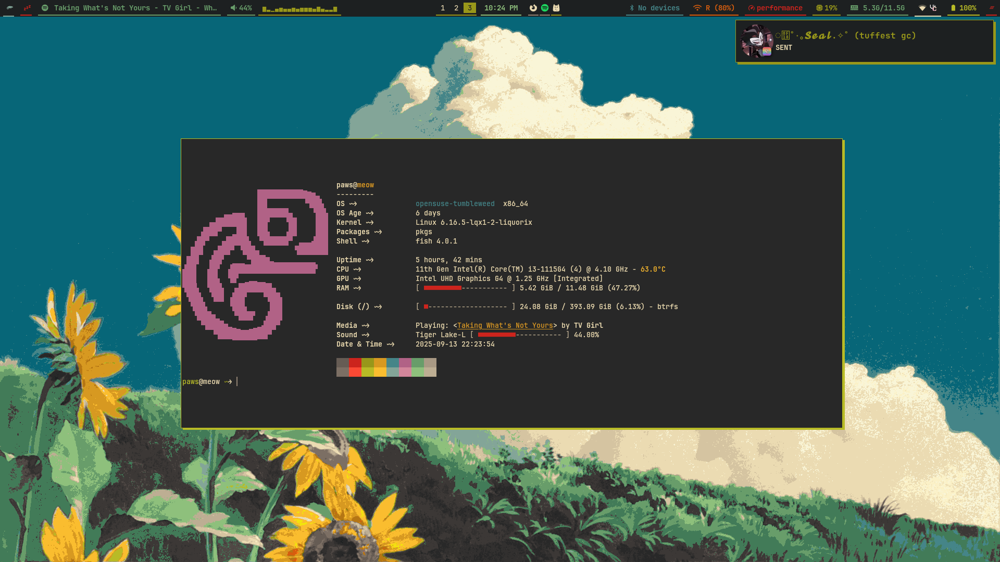
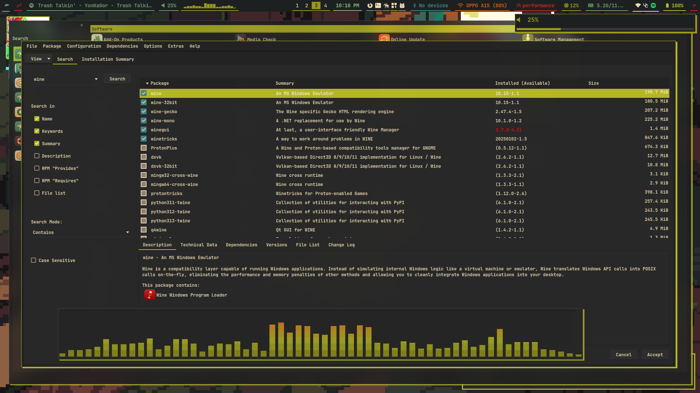
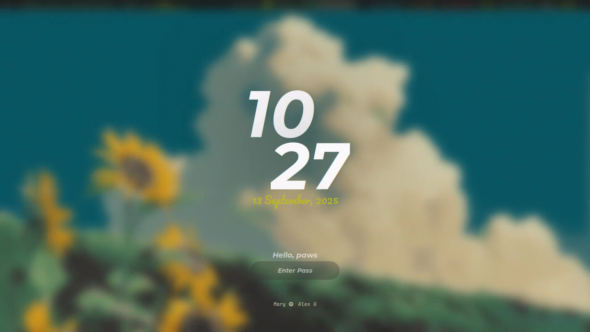

# Fen's Rice

> Just my own **Gruvbox-flavored Hyprland** setup.
  
> ⚠️ This is not a plug-and-play dotfiles repo — a lot of the paths and scripts are hardcoded to my machine.

---

## Why

I built this because I wanted:
- a **dark, warm look** that doesn’t strain my eyes,
- tiling workflow with **Hyprland**,  
- some small tweaks and scripts that just make sense for *my* daily use.

It’s messy, but it works for me.

---

## What’s Inside

- **Operating System:** Opensuse Tumbleweed
- **Window Manager:** [Hyprland](https://github.com/hyprwm/Hyprland)
- **Colors:** Classic [Gruvbox Dark](https://github.com/morhetz/gruvbox)
- **Bar/Widgets:** eww (a few custom scripts)
- **Terminal:** Kitty
- **Fonts:** JetBrainsMono Nerd Font
- **GTK Theme:** Gruvbox Material

*(Some configs call absolute paths like `/home/myuser/scripts/…` — change these if you try them yourself.)*

---

## Screenshots

| Normal Desktop | Tiling |
|-----------------|-------|
|  |  |
| yast | Hyprlock |
|  |  |

*(add your own screenshots in `screenshots/` folder)*

---

