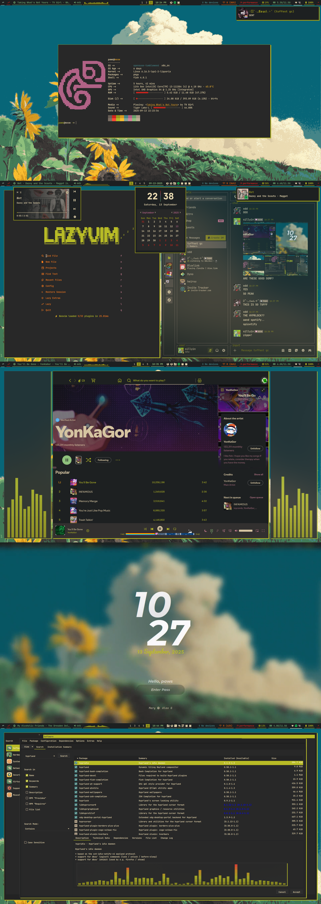
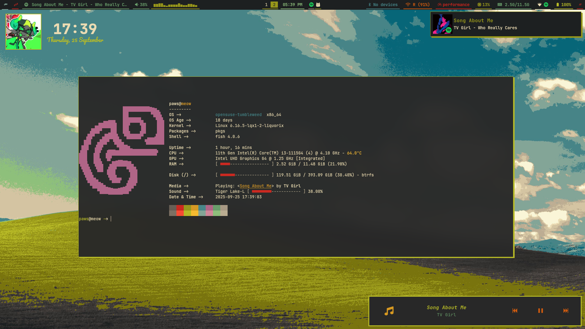
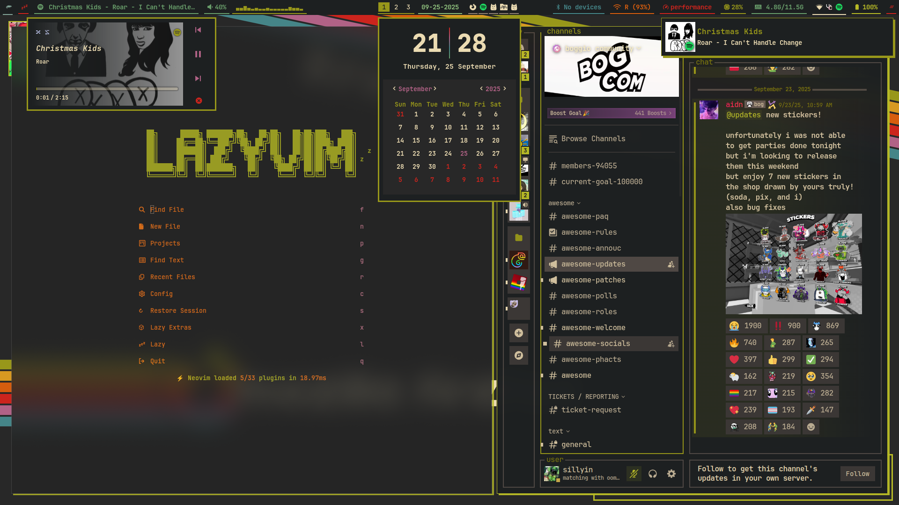

# Fen's Rice

> Just my own **Gruvbox-flavored Hyprland** setup.
  
> ⚠️ This is not a plug-and-play dotfiles repo — a lot of the paths and scripts are hardcoded to my machine.

---

## Why

I built this because I wanted:
- a **dark, warm look** that doesn’t strain my eyes,
- tiling workflow with **Hyprland**,  
- some small tweaks and scripts that just make sense for *my* daily use.

It’s messy, but it works for me.

---

## What’s Inside

**Core**
- OS: openSUSE Tumbleweed
- WM: [Hyprland](https://github.com/hyprwm/Hyprland)

**Look & Feel**
- Colors: [Gruvbox Dark](https://github.com/morhetz/gruvbox)
- GTK Theme: [Gruvbox Dark Hard](…)
- Icons: [Gruvbox Plus Dark](…)
- Cursor: [ArcAurora](…)

**Apps**
- Bar: Waybar
- Widgets: eww
- Terminal: Kitty
- Fonts: JetBrainsMono Nerd Font, Pacifico, Montserrat

---

## Screenshots

### Main
| Normal Desktop | Tiling |
|-----------------|-------|
|  |  |

### Extras
| YaST | Hyprlock |
|------|---------|
|  |  |

---

